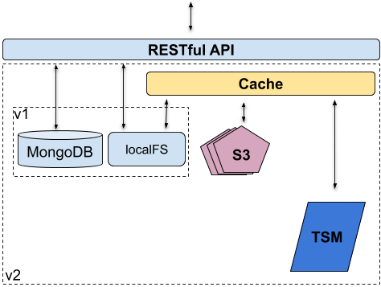

# Shock concepts

## Introduction

- Traditionally Shock combines an on disk storage hierarchy with a Mongo database for metadata.
- As of version 1.0 a Shock server can download items present in its Mongo database from remote locations and cache them locally
- The "Traditional" behavior is the default model. The system is backward compatible.
- As of v1.0 Shock has become a hierarchical storage management system (HSM)
- A Shock server is made aware of remote locations via a Locations.yaml file, see the example
- Supported remote location types are: 
    * Shock (Type: Shock)
    * S3 (Type: S3)
    * IBM Tivoli TSM (Type: TSM)
- We hope to support the following in the future (pull requests welcome):
    * DAOS
    * Amazon Glacier
    * Google Cloud Storage
    * Microsoft Azure Data Storage
- Shock nodes are migrated listed for migration by external scripts (check the /scripts folder in this repo) by the server according to the paramters provided
- the new /location/<locname>/{missing|present|inflight} query lists the files that need to be backed up missing, the ones current being backed-up (inflight) and those stored already (present)

### Caching
Shock can cache nodes on local disk from remove Locations.

### Data and Metadata
Shock stores data in files and metadata in a MongoDB database.

### HSM -- hierarchical storage management
Shock can be configured to move data not used for a while to tape storage.

### Locations
Defined in Locations.yaml and `node/<node_id>/locations/ ` are alternative storage locations for node data. This will be used if `"PATH_CACHE"` is not nil and node files are not present on local disk.

